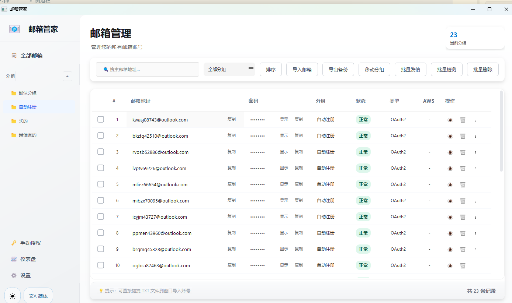
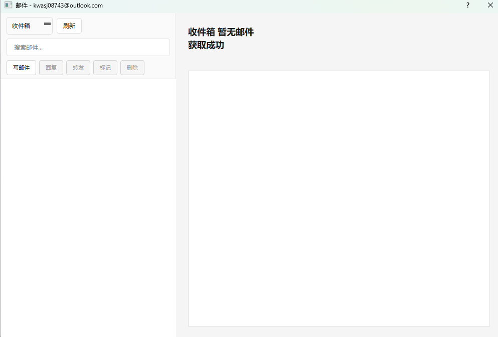

# 邮箱管家

批量邮箱账号管理工具，支持 OAuth2 认证和普通 IMAP 登录，采用 Microsoft Fluent Design 风格界面。

## ✨ 功能特性

### 账号管理
- 📥 批量导入/导出邮箱账号
- 📋 从剪贴板快速导入（支持 Ctrl+Shift+V 快捷键）
- 🔄 拖拽 TXT 文件直接导入
- 🗂️ 分组管理（新建、重命名、删除）
- ✅ 导入时自动去重检测
- 📝 账号备注功能

### 邮件功能
- 📧 邮件查看（收件箱、垃圾邮件、已发送等）
- ✉️ 写邮件、回复、转发
- 📎 附件支持
- 🔍 邮件搜索
- 📬 批量发送邮件

### 状态检测
- 🔍 批量检测账号状态
- 🏷️ AWS 验证码邮件自动标记
- 📊 账号统计仪表盘

### 界面特性
- 🌙 明暗主题切换
- 🌐 中英文双语支持
- 🖱️ 右键上下文菜单
- 📱 系统托盘最小化
- 🎨 现代化 Fluent Design 风格

## 📦 支持的导入格式

```
邮箱----密码----Client_ID----Refresh_Token
```

多账号分隔方式：
- `$` 分隔：`账号1$账号2$账号3`
- 换行分隔：每行一个账号

示例：
```
user@outlook.com----password----client_id----refresh_token
user2@outlook.com----pass2----client_id----token2
```

## 🔐 认证方式

| 邮箱类型 | 认证方式 | 说明 |
|---------|---------|------|
| Outlook/Hotmail | OAuth2 | 自动识别 API 类型（Graph API 或 Outlook REST API） |
| QQ/163/Gmail | IMAP | 使用授权码作为密码 |

### OAuth2 手动授权

对于没有 Token 的 Outlook 账号，可以使用「手动授权」功能：
1. 点击侧边栏「OAuth2 授权」按钮
2. 程序会打开 Edge 浏览器（InPrivate 模式）
3. 手动完成 Microsoft 登录流程
4. 程序自动捕获授权码并获取 Token
5. Token 保存到数据库

## 🚀 运行方式

```bash
# 安装依赖
pip install -r requirements.txt -i https://pypi.tuna.tsinghua.edu.cn/simple

# 运行
python main.py
```

## 📦 打包为 EXE

```bash
build.bat
```

打包后文件在 `dist/邮箱管家/` 目录。

## 💾 数据存储

数据库位置：`data/emails.db`（与程序同目录，支持打包后相对路径）

## 📁 项目结构

```
邮箱管家/
├── main.py              # 入口文件
├── core/
│   ├── email_client.py  # 邮件客户端（OAuth2 + IMAP）
│   ├── oauth2_helper.py # OAuth2 授权（Selenium + Edge）
│   └── i18n.py          # 国际化支持
├── database/
│   └── db_manager.py    # SQLite 数据库管理
├── ui/
│   ├── main_window.py   # 主窗口
│   ├── sidebar.py       # 侧边栏
│   ├── dialogs.py       # 对话框
│   ├── theme.py         # 主题管理（明暗主题）
│   └── system_tray.py   # 系统托盘
├── assets/              # 图标资源
└── data/
    └── emails.db        # 数据库文件
```

## ⌨️ 快捷键

| 快捷键 | 功能 |
|-------|------|
| Ctrl+Shift+V | 从剪贴板导入账号 |
| 拖拽 TXT 文件 | 快速导入账号 |

## 🛠️ 技术栈

- **PyQt5** - GUI 框架
- **SQLite** - 本地数据库
- **Microsoft Graph API / Outlook REST API** - Outlook 邮件
- **IMAP/SMTP** - 普通邮箱协议
- **Selenium** - OAuth2 授权自动化

## 📸 截图





## 📄 许可证

MIT License
